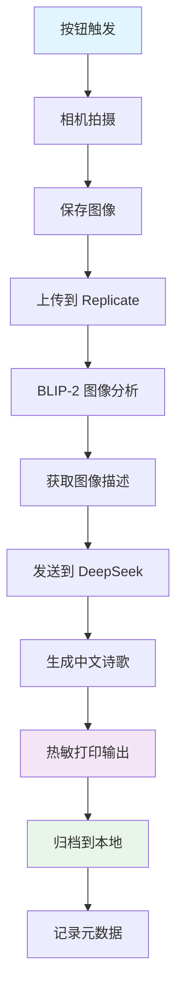

# 🎨 诗歌相机 (Poetry Camera)

[](https://github.com/youjiaping123/new-poetry-camera)
[](LICENSE)
[](https://www.raspberrypi.org/)
[](https://www.python.org/)

> 一台能看懂世界并为所见之物创作诗歌的智能相机 📸✨

将瞬间定格，让 AI 理解眼前的世界，并创作出充满诗意的中文诗歌。每一次快门都是一次创作，每一首诗都是对美好时光的记录。

## 📑 目录

- [✨ 核心特性](#-核心特性)
- [🛠️ 硬件清单](#️-硬件清单)
- [📦 快速安装](#-快速安装)
- [⚙️ 配置详解](#️-配置详解)
- [🚀 使用指南](#-使用指南)
- [📁 项目架构](#-项目架构)
- [🧪 测试验证](#-测试验证)
- [🐛 故障排除](#-故障排除)
- [📄 附录](#-附录)

---

## ✨ 核心特性

🤖 **智能图像理解** - 基于 BLIP-2 模型，深度理解图像内容与情感  
✍️ **中文诗歌创作** - 使用 DeepSeek API，生成富有文学性的现代诗歌  
🖨️ **即时热敏打印** - 支持 ESC/POS 协议打印机，随拍随印  
🗂️ **智能归档管理** - 自动保存诗歌文本与元数据，便于回顾与分享  
📊 **系统级日志** - 完整的运行日志记录，支持实时监控与调试  
🔄 **开机自启动** - SystemD 服务管理，稳定可靠的后台运行  

---

## 🎯 项目演示

### 工作流程
```
📸 按下按钮 → 📷 拍摄照片 → 🤖 AI分析图像 → ✍️ 生成诗歌 → 🖨️ 打印输出 → 🗂️ 自动归档
```

---

## 🛠️ 硬件清单

### 必需组件
| 组件 | 型号推荐 | 数量 | 说明 |
|------|----------|------|------|
| **主控板** | Raspberry Pi Zero 2W | 1 | 或其他 Pi 系列 |
| **相机模块** | Pi Camera Module 3 | 1 | 或兼容的 CSI 相机 |
| **热敏打印机** | Adafruit Mini Thermal Printer | 1 | 支持 TTL 串口 |
| **按钮模块** | 3引脚按钮 (VCC/OUT/GND) | 1 | 触发拍照 |
| **电源** | 5V 3A 移动电源 | 1 | 确保打印机供电充足 |
| **连接线** | 杜邦线若干 | - | 连接各模块 |

### 功耗说明
- **待机功耗**: ~2W (仅 Pi + 相机)
- **工作功耗**: ~15W (打印时)
- **建议电源**: 5V 3A (15W) 或更大容量移动电源

---

## 📦 快速安装

### 1️⃣ 系统环境准备

首先确保树莓派系统为最新版本 (Raspberry Pi OS Lite 或 Desktop)：

```bash
# 更新系统
sudo apt update && sudo apt upgrade -y

# 安装必要的系统依赖
sudo apt install -y \
    python3-pip \
    python3-venv \
    python3-picamera2 \
    python3-full \
    git \
    build-essential \
    curl
```

### 2️⃣ 启用硬件接口

使用 `raspi-config` 配置硬件接口：

```bash
sudo raspi-config
```

**配置项目**：
- `Interface Options` → `Camera` → `Enable`
- `Interface Options` → `Serial Port`:
  - `Login shell over serial` → **No**
  - `Serial port hardware` → **Yes**

配置完成后重启：
```bash
sudo reboot
```

### 3️⃣ 用户权限设置

将当前用户添加到必要的组：

```bash
sudo usermod -a -G dialout,video $USER
```

**重要**: 添加组后需要重新登录或重启才能生效。

### 4️⃣ 项目部署

克隆项目到树莓派：

```bash
cd ~
git clone https://github.com/youjiaping123/new-poetry-camera.git
cd new-poetry-camera
```

或者通过现有的同步任务更新项目文件。

### 5️⃣ Python 环境设置

创建虚拟环境并安装依赖：

```bash
# 创建虚拟环境 (保持系统 picamera2 可用)
python3 -m venv --system-site-packages venv

# 激活虚拟环境
source venv/bin/activate

# 升级 pip
pip install --upgrade pip

# 安装项目依赖
pip install -r requirements.txt
```

### 6️⃣ 环境配置

复制配置模板并编辑：

```bash
cp .env.example .env
nano .env
```

**必需配置项**：
```bash
# DeepSeek API 密钥 (用于诗歌生成)
DEEPSEEK_API_KEY=your_deepseek_api_key_here

# Replicate API 令牌 (用于图像理解)
REPLICATE_API_TOKEN=your_replicate_api_token_here
```

### 7️⃣ 硬件测试

在正式运行前，测试各个硬件模块：

```bash
# 激活虚拟环境
source venv/bin/activate

# 测试相机
python tests/test_camera.py

# 测试打印机
python tests/test_printer.py

# 测试按钮
python tests/test_button_simple.py

# 测试完整流程
python tests/test_complete_flow.py
```

---

## ⚙️ 配置详解

### 环境变量说明

| 配置项 | 默认值 | 说明 |
|--------|--------|------|
| `DEEPSEEK_API_KEY` | - | **必填** DeepSeek API 密钥 |
| `REPLICATE_API_TOKEN` | - | **必填** Replicate API 令牌 |
| `SERIAL_PORT` | `/dev/serial0` | 打印机串口设备 |
| `PRINTER_BAUD` | `9600` | 打印机波特率 |
| `BUTTON_PIN` | `17` | 按钮 GPIO 引脚 (BCM 编号) |
| `LED_PIN` | `27` | 状态指示灯引脚 (可选) |
| `CAMERA_WIDTH` | `1920` | 相机分辨率宽度 |
| `CAMERA_HEIGHT` | `1080` | 相机分辨率高度 |
| `LOG_LEVEL` | `INFO` | 日志级别 (`DEBUG`/`INFO`/`WARNING`/`ERROR`) |
| `LOG_FILE` | `poetry-camera.log` | 日志文件路径 |
| `DATA_DIR` | `data` | 数据目录 (图像存储) |
| `POEM_ARCHIVE_DIR` | `poems` | 诗歌归档目录 |
| `HTTP_TIMEOUT` | `30` | API 请求超时时间 (秒) |

### API 密钥获取

#### DeepSeek API
1. 访问 [DeepSeek 开放平台](https://platform.deepseek.com/)
2. 注册账号并完成实名认证
3. 在控制台中创建 API 密钥
4. 复制密钥到 `.env` 文件

#### Replicate API
1. 访问 [Replicate 官网](https://replicate.com/)
2. 使用 GitHub 账号登录
3. 在 Account Settings 中获取 API Token
4. 复制令牌到 `.env` 文件

### 硬件参数调优

#### 串口波特率选择
- `9600`: 最稳定，适合大多数打印机
- `19200`: 较快速度，适合质量较好的连接线
- `115200`: 最快速度，需要短距离和优质连接

#### 相机分辨率建议
- 高质量: `1920x1080` (默认)
- 平衡模式: `1280x720` (更快处理)
- 省电模式: `640x480` (最低功耗)

---

## 🚀 使用指南

### 基础运行

#### 手动启动 (开发调试)
```bash
cd /home/pi/new-poetry-camera
source venv/bin/activate
python main.py
```

#### 操作说明
- **短按按钮**: 拍照并生成打印诗歌
- **长按按钮 (2秒)**: 安全退出程序
- **Ctrl+C**: 强制中断 (调试模式)

### 开机自启动

使用 SystemD 服务实现开机自动运行：

#### 安装服务
```bash
cd /home/pi/new-poetry-camera
sudo bash scripts/install_service.sh
```

#### 服务管理
```bash
# 查看服务状态
sudo systemctl status poetry-camera.service

# 启动/停止/重启服务
sudo systemctl start poetry-camera.service
sudo systemctl stop poetry-camera.service
sudo systemctl restart poetry-camera.service

# 禁用/启用开机自启
sudo systemctl disable poetry-camera.service
sudo systemctl enable poetry-camera.service
```

### 日志监控

#### 实时日志 (推荐)
```bash
# SystemD 日志 (推荐)
sudo journalctl -fu poetry-camera.service

# 应用程序日志
tail -f /home/pi/new-poetry-camera/poetry-camera.log
```

#### 历史日志
```bash
# 查看上一次启动的日志
sudo journalctl -b -1 -u poetry-camera.service

# 查看最近 100 行日志
sudo journalctl -u poetry-camera.service -n 100 --no-pager

# 查看特定时间段日志
sudo journalctl -u poetry-camera.service --since "1 hour ago"
```

### 诗歌归档

每次成功生成的诗歌都会自动保存到 `poems/` 目录：

```
poems/
├── poems.jsonl              # 元数据索引 (JSON Lines)
├── poem_20241028_142530.txt # 诗歌文本文件
├── poem_20241028_143015.txt
└── ...
```

#### 查看归档
```bash
# 查看最新诗歌
tail -n 1 poems/poems.jsonl | jq '.'

# 查看所有诗歌元数据
cat poems/poems.jsonl | jq '.'

# 统计诗歌数量
wc -l poems/poems.jsonl
```

---

## 📁 项目架构

### 目录结构
```
new-poetry-camera/
├── 📄 README.md              # 项目文档
├── 📄 requirements.txt       # Python 依赖清单
├── 📄 .env.example          # 环境变量模板
├── 🐍 main.py               # 主程序入口
├── 🔧 install.sh            # 安装脚本
├── 📁 src/                  # 核心源码
│   ├── 🎯 __init__.py       # 包初始化
│   ├── ⚙️ config.py         # 配置管理
│   ├── 📷 camera.py         # 相机控制
│   ├── 🖨️ printer.py        # 打印机控制  
│   ├── 🤖 ai_service.py     # AI 服务集成
│   ├── 🔘 gpio_controller.py # GPIO 按钮控制
│   ├── 🗂️ archive.py        # 诗歌归档管理
│   └── 🛠️ utils.py          # 工具函数
├── 📁 tests/               # 测试模块
│   ├── 🧪 test_camera.py    # 相机功能测试
│   ├── 🧪 test_printer.py   # 打印机测试
│   ├── 🧪 test_button_simple.py # 按钮测试
│   └── 🧪 test_complete_flow.py # 完整流程测试
├── 📁 scripts/             # 实用脚本
│   ├── 🔧 install_service.sh    # 服务安装
│   └── 🔧 shutdown_printer.py   # 打印机关闭
├── 📁 systemd/             # 系统服务
│   └── ⚡ poetry-camera.service # SystemD 单元文件
├── 📁 data/               # 运行时数据 (自动创建)
│   ├── 📸 images/         # 拍摄的照片
│   ├── 📤 uploads/        # 上传临时文件  
│   └── ✅ processed/      # 已处理文件
├── 📁 poems/              # 诗歌归档 (自动创建)
│   ├── 📄 poems.jsonl     # 元数据索引
│   └── 📄 poem_*.txt      # 诗歌文本文件
└── 📄 poetry-camera.log   # 应用日志 (自动创建)
```

### 核心模块说明

#### 🎯 主程序 (`main.py`)
- **PoetryCamera** 类：统筹管理所有子模块
- 信号处理：优雅响应 Ctrl+C 和系统关机信号
- 循环监听：持续监控按钮状态，响应用户操作
- 流程协调：串联拍照→AI处理→打印→归档的完整流程

#### ⚙️ 配置管理 (`src/config.py`)
- **单例模式**：确保全局配置一致性
- **环境变量**：从 `.env` 文件和系统环境加载配置
- **路径管理**：自动创建必要的数据目录
- **配置验证**：启动时检查必需的 API 密钥

#### 📷 相机控制 (`src/camera.py`)
- **Picamera2 集成**：支持树莓派官方相机模块
- **分辨率配置**：可调整拍摄分辨率以平衡质量和性能
- **自动命名**：基于时间戳生成唯一文件名
- **异常处理**：相机初始化失败时的降级处理

#### 🤖 AI 服务 (`src/ai_service.py`)
- **图像理解**：使用 Replicate BLIP-2 模型分析图像内容
- **诗歌生成**：调用 DeepSeek API 根据图像描述创作诗歌
- **重试机制**：网络请求失败时的自动重试
- **结构化输出**：返回包含描述和诗歌的 `PoemResult` 对象

#### 🖨️ 打印机控制 (`src/printer.py`)
- **ESC/POS 协议**：支持标准热敏打印机指令集
- **中文编码**：自动处理 GB18030/UTF-8 编码转换
- **格式美化**：添加时间戳、装饰线和署名信息
- **休眠机制**：关机时主动让打印机进入休眠状态

#### 🔘 GPIO 控制 (`src/gpio_controller.py`)
- **按钮检测**：支持短按和长按事件识别
- **防抖处理**：避免机械按钮的多次触发
- **超时机制**：非阻塞式按钮监听
- **LED 控制**：可选的状态指示灯支持

#### 🗂️ 归档管理 (`src/archive.py`)
- **结构化存储**：每首诗歌对应独立文本文件
- **元数据索引**：JSON Lines 格式记录完整信息
- **时间戳命名**：确保文件名唯一且有序
- **路径处理**：兼容项目内外的文件路径

### 数据流向图



### 扩展开发指南

#### 添加新的 AI 模型
1. 在 `src/ai_service.py` 中添加新的服务提供商
2. 实现统一的接口规范 (`generate_image_caption`, `generate_poem`)
3. 在配置文件中添加对应的 API 密钥配置
4. 编写相应的测试用例

#### 支持新的打印机
1. 在 `src/printer.py` 中扩展 `ThermalPrinter` 类
2. 添加特定型号的初始化参数
3. 实现设备特有的控制指令
4. 更新文档中的硬件兼容性列表

#### 自定义诗歌模板
1. 修改 `src/utils.py` 中的 `format_header`、`format_footer` 函数
2. 调整 `src/ai_service.py` 中的提示词模板
3. 在配置文件中添加可选的格式参数

---

## 🧪 测试验证

### 单元测试

项目提供了完整的测试套件，可以独立验证各个硬件模块：

#### 相机测试
```bash
python tests/test_camera.py
```
**检查项目**：
- Picamera2 库是否正确安装
- 相机硬件是否被识别
- 拍照功能是否正常
- 图像文件是否正确保存

#### 打印机测试  
```bash
python tests/test_printer.py
```
**检查项目**：
- 串口通信是否建立
- ESC/POS 指令是否响应
- 中文字符打印效果
- 纸张走纸是否正常

#### 按钮测试
```bash
python tests/test_button_simple.py
```
**检查项目**：
- GPIO 引脚配置是否正确
- 按钮状态读取是否准确
- 短按/长按识别是否灵敏
- 防抖机制是否有效

#### 完整流程测试
```bash
python tests/test_complete_flow.py
```
**检查项目**：
- AI API 连接是否稳定
- 端到端工作流程
- 异常处理机制
- 归档功能验证

### 性能基准

在标准配置下的性能指标：

| 阶段 | 耗时 | 说明 |
|------|------|------|
| 系统初始化 | ~3-5秒 | 相机/打印机/GPIO 初始化 |
| 拍照 | ~0.5秒 | 1920x1080 分辨率 |
| 图像分析 | ~10-15秒 | 取决于网络延迟 |
| 诗歌生成 | ~5-10秒 | DeepSeek API 响应时间 |
| 热敏打印 | ~10-15秒 | 8行诗歌 + 装饰 |
| **总计** | **~30-45秒** | 从按钮到完成 |

### 质量检查清单

部署前的验证步骤：

- [ ] 硬件连接：检查所有接线是否牢固
- [ ] 电源充足：确保 5V 3A 供电能力
- [ ] 权限配置：用户已加入 `dialout` 和 `video` 组
- [ ] API 密钥：DeepSeek 和 Replicate 令牌有效
- [ ] 网络连接：确保可以访问外部 API
- [ ] 存储空间：至少 1GB 可用空间用于日志和归档
- [ ] 系统服务：SystemD 服务正常启动
- [ ] 日志输出：`journalctl` 可以查看实时日志

---

## 🐛 故障排除

### 常见问题及解决方案

#### 🔧 系统级问题

**问题**: 相机无法初始化
```bash
# 检查相机模块是否被识别
libcamera-hello --list-cameras

# 测试基础拍照功能
libcamera-jpeg -o test.jpg --timeout 2000

# 确保相机接口已启用
sudo raspi-config
# Interface Options → Camera → Enable
```

**问题**: 串口权限被拒绝
```bash
# 检查用户组
groups $USER

# 添加到 dialout 组 (需要重新登录生效)
sudo usermod -a -G dialout $USER

# 检查串口设备
ls -l /dev/serial*
ls -l /dev/ttyS0
```

**问题**: GPIO 引脚访问失败
```bash
# 检查 GPIO 状态
gpio readall

# 确保没有其他程序占用引脚
sudo lsof | grep gpio
```

#### 🌐 网络连接问题

**问题**: API 请求超时
```bash
# 测试网络连接
ping -c 3 8.8.8.8

# 检查 DNS 解析
nslookup api.deepseek.com
nslookup api.replicate.com

# 临时增加超时时间
export HTTP_TIMEOUT=60
```

**问题**: SSL 证书错误
```bash
# 更新证书库
sudo apt update
sudo apt install -y ca-certificates

# 同步系统时间
sudo ntpdate -s time.nist.gov
```

#### 🖨️ 打印机问题

**问题**: 打印乱码或无输出
```bash
# 检查串口设备
sudo dmesg | grep tty

# 尝试不同波特率
# 在 .env 文件中修改 PRINTER_BAUD=19200

# 手动发送测试命令
echo -e "\x1B@Hello World\n\n\n" > /dev/serial0
```

**问题**: 开机时打印乱码
- 这通常是串口初始化时的噪声导致
- 项目已内置防护机制（`ExecStartPre` 等待设备稳定）
- 如仍有问题，可适当延长等待时间

**问题**: 打印质量差
```bash
# 调整打印密度 (在 printer.py 中)
# ESC 7 指令的参数: [加热时间, 加热间隔, 打印密度]
# 默认: [11, 200, 50]
# 可尝试: [15, 250, 60] (更深但更慢)
```

#### 🤖 AI 服务问题

**问题**: DeepSeek API 配额不足
```bash
# 检查 API 使用情况
curl -H "Authorization: Bearer $DEEPSEEK_API_KEY" \
     https://api.deepseek.com/v1/usage
```

**问题**: Replicate 模型加载缓慢
- 首次调用 BLIP-2 模型时需要冷启动
- 可以考虑预热请求或使用其他图像理解服务

**问题**: 生成的诗歌质量不佳
- 检查图像质量和光照条件
- 调整 `ai_service.py` 中的提示词模板
- 尝试不同的诗歌格式参数

### 调试技巧

#### 启用详细日志
```bash
# 临时启用 DEBUG 级别
export LOG_LEVEL=DEBUG
python main.py

# 或修改 .env 文件
echo "LOG_LEVEL=DEBUG" >> .env
```

#### 单步调试模式
```bash
# 停止自动服务
sudo systemctl stop poetry-camera.service

# 手动运行并观察输出
cd /home/pi/new-poetry-camera
source venv/bin/activate
python main.py
```

#### 网络请求调试
```bash
# 启用 httpx 详细日志
export PYTHONPATH=$PYTHONPATH:/home/pi/new-poetry-camera
python -c "
import logging
import httpx
logging.basicConfig(level=logging.DEBUG)
# 然后运行你的测试代码
"
```

### 性能优化建议

#### 降低延迟
- 使用有线网络连接代替 WiFi
- 选择地理位置更近的 API 服务器
- 适当降低相机分辨率 (如 1280x720)

#### 节省流量
- 启用图像压缩 (在 `camera.py` 中配置)
- 缓存重复的 API 响应
- 使用本地图像理解模型 (需要额外开发)

#### 延长续航
- 降低相机分辨率和帧率
- 优化打印机功耗设置
- 添加休眠模式支持

---

## 📄 附录

### 许可证

本项目采用 **MIT 许可证**，详见 [LICENSE](LICENSE) 文件。

### 贡献指南

欢迎提交 Issue 和 Pull Request！

**开发环境设置**：
```bash
git clone https://github.com/youjiaping123/new-poetry-camera.git
cd new-poetry-camera
python3 -m venv venv
source venv/bin/activate
pip install -r requirements.txt
```

**代码规范**：
- 使用 Black 进行代码格式化
- 遵循 PEP 8 编码标准  
- 添加必要的类型注解
- 编写对应的测试用例

### 更新日志

#### v2.0.0 (2024-10-28)
- ✨ 重构整体架构，提升代码质量
- ✨ 新增诗歌自动归档功能
- ✨ 集成 SystemD 服务管理
- ✨ 完善的日志系统和错误处理
- 🐛 修复打印机开关机乱码问题
- 🐛 优化 AI API 调用稳定性

#### v1.0.0 (2024-09-15)
- 🎉 首个稳定版本发布
- ✨ 基础拍照和诗歌生成功能
- ✨ 热敏打印机支持

### 技术栈

- **硬件**: Raspberry Pi, Pi Camera, Thermal Printer
- **系统**: Raspberry Pi OS (Debian-based)
- **语言**: Python 3.9+
- **AI**: BLIP-2 (Replicate), DeepSeek API
- **通信**: Serial Port (UART), GPIO
- **服务**: SystemD, journald

### 致谢

- 感谢 [DeepSeek](https://platform.deepseek.com/) 提供优秀的中文语言模型
- 感谢 [Replicate](https://replicate.com/) 提供便捷的 AI 模型托管服务
- 感谢树莓派基金会提供优秀的开源硬件平台
- 感谢所有开源项目贡献者

---

<div align="center">

**🎨 让每一个瞬间都充满诗意 🎨**

Made with ❤️ by [youjiaping123](https://github.com/youjiaping123)

</div>
